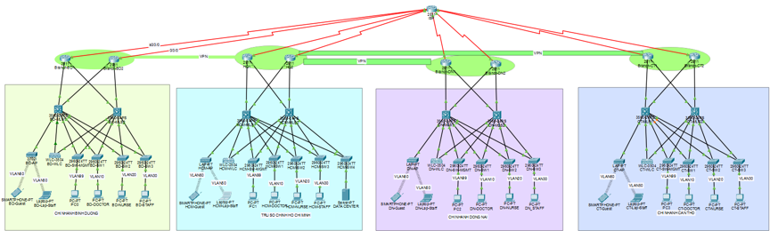

# Enterprise Network Architecture for MedCare International Hospital

## 📌 Overview
This project focuses on designing and simulating a comprehensive, secure, and highly available enterprise network infrastructure for **MedCare International Hospital**, a modern multi-branch healthcare system. 

The complete network layout, inter-VLAN routing, and security policies are simulated and validated using **Cisco Packet Tracer**.

---

## 👥 Project Team Members

| Full Name | Student ID |
| :--- | :---: |
| Nguyễn Thị Lệ Trúc | 23521670 |
| Nguyễn Hữu Luân | 23520898 |
| Lê Trung Kiên | 23520797 |
| Nguyễn Đăng Khoa | 23520747 |

---

## 📂 Repository Structure

Below is the layout of the project files and directories contained within this repository:
.
├── Bang_phan_chia_IP.docx      # Detailed IP Addressing & VLSM Subnet Plan
├── Plan.docx                   # Project Implementation Plan & PDIOO Workflow
├── README.md                   # Project Documentation & Architecture Overview
├── config/                     # Network Device Configurations
│   ├── Configuration.docx      # Step-by-step configuration commands & logs
│   └── MedCare-configure.pkt   # Original Cisco Packet Tracer Simulation File
└── diagrams/                   # Architecture Network Diagrams
    └── physical_topology.png   # Full Physical Network Topology Image

---

## 🛠️ Key Architectural Features

* **Three-Tier Hierarchical Model:** Built on a standardized Core – Distribution – Access enterprise architecture using Layer 3 switches for high-performance Inter-VLAN routing.
* **Role-Based Network Segmentation (VLANs):** Complete logical separation between different user groups (Doctors, Nurses, Staff, and Guests) to reduce broadcast domains and secure confidential medical data.
* **High Availability & Redundancy:** Implemented **HSRP (Hot Standby Router Protocol)** to provide seamless gateway redundancy and eliminate single points of failure.
* **Secure Multi-Branch Connectivity:** Engineered a Hub-and-Spoke WAN topology using **GRE Tunnels** paired with **OSPF** dynamic routing and encrypted **Site-to-Site VPNs** to securely synchronize EHR data between the Headquarters (HQ) and Regional Branches.
* **Strict Traffic Control:** Enforced **Access Control Lists (ACLs)** acting as firewalls to isolate the guest Wi-Fi network from production medical environments, adhering to basic Zero-Trust security principles.
* **Enterprise Wireless Deployment:** Managed distinct SSIDs (`WiFi_Staff` and `WiFi_Guest`) powered by a virtualized Wireless LAN Controller (WLC).

---

## 🗺️ Network Topology & Address Space

The infrastructure interconnects the **Ho Chi Minh City Headquarters (HQ)** with three regional network branches: **Binh Duong**, **Dong Nai**, and **Can Tho**.

### 📊 Physical Network Topology

### Network Segmentation (VLAN Allocation)

| Location | VLAN | Name | Subnet (CIDR) | Gateway | Purpose |
| :--- | :---: | :--- | :--- | :--- | :--- |
| **HQ - HCMC** | 10 | DOCTORS | `10.10.10.0/23` | `10.10.10.1` | Medical Staff PCs |
| | 20 | NURSES | `10.10.20.0/22` | `10.10.20.1` | Nursing Stations |
| | 30 | STAFF | `10.10.30.0/24` | `10.10.30.1` | Administration |
| | 40 | SERVERS | `10.10.40.0/26` | `10.10.40.1` | EHR, PACS, HIS Servers |
| | 50 | STAFF_WIFI | `10.10.50.0/22` | `10.10.50.1` | Internal Wireless Devices |
| | 60 | GUEST_WIFI | `10.10.60.0/22` | `10.10.60.1` | Public Wi-Fi for Patients |
| | 99 | MANAGEMENT | `10.10.99.0/26` | `10.10.99.1` | Infrastructure Management |
| **Branches** | 10 | XX_DOCTORS | `10.X.10.0/24` | `10.X.10.1` | Core Data |
| *(BD: `10.20.x.x`)* | 20 | XX_NURSES | `10.X.20.0/23` | `10.X.20.1` | Core Data |
| *(DN: `10.30.x.x`)* | 30 | XX_STAFF | `10.X.30.0/25` | `10.X.30.1` | Administration |
| *(CT: `10.40.x.x`)* | 50 | XX_STAFF_WIFI| `10.X.50.0/23` | `10.X.50.1` | Internal Wireless |
| | 60 | XX_GUEST_WIFI| `10.X.60.0/23` | `10.X.60.1` | Public Wi-Fi |
| | 99 | XX_MANAGEMENT| `10.X.99.0/26` | `10.X.99.1` | Device Management |

---

## 🔒 Security Configuration Highlights

### 1. Guest Wi-Fi Isolation (ACL)
To maintain strict compliance with data safety standards, an inbound Access Control List is applied at the Layer 3 Switch/Router level on **VLAN 60** interfaces. This explicitly permits public Internet traffic via NAT while dropping any packet targeted at private infrastructure blocks (`10.0.0.0/8`).

### 2. Management & Core Hardening
* VLAN 99 is entirely dedicated to infrastructure maintenance.
* Administrative management interfaces (SSH, HTTPS, SNMP) on switches and routers are restricted to accept connections coming exclusively from authorized administrative terminal subnets.

---

## 💻 Tech Stack & Hardware Components

The network architecture leverages enterprise-grade Cisco solutions mapped out within the simulation environment:
* **Edge Routers:** Cisco ISR 4331/K9 (Handling WAN, NAT Overload/PAT, and VPN Termination)
* **Core Switches:** Cisco WS-C3850-24T-L (Layer 3 Inter-VLAN Routing & Distributed DHCP Services)
* **Access Switches:** Cisco Catalyst 2960X Series
* **Wireless Infrastructure:** Cisco Catalyst 9800-CL Wireless Controller & Aruba Instant On AP22 Access Points
* **Security Appliances:** Cisco ASA 5506-X Firewalls
* **Network Protocols:** OSPF, GRE Tunneling, IPsec VPN, HSRP, IEEE 802.1Q (Trunking), NAT Overload

---

## 🚀 Future Roadmap
* Migrate the simulation layout into advanced virtual laboratory systems like **GNS3** or **EVE-NG** to test real Cisco IOS behaviors.
* Introduce dynamic Quality of Service (QoS) mappings tailored for high-priority Telemedicine video feeds and low-latency voice streams.
* Integrate full **Zero-Trust Access Architecture** coupled with automated SIEM log monitoring and Cloud-Based AI Threat Detection.
